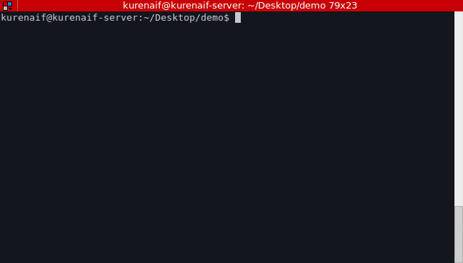
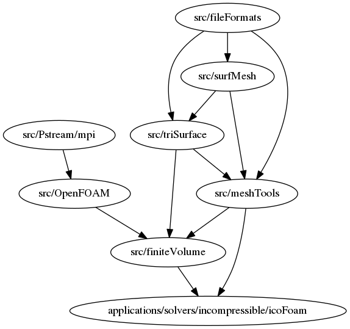

# auto_wmake

Build the OpenFOAM app you want with the minimum wmake you need.


## Description

Conventionally, OpenFOAM apps (`blockMesh`, `icoFoam`, `pimpleFoam`, and so on.) have be built with `Allwmake` command.
but Allwmake command take a while. somewhere between 30minites to 3-6 hours.
`Allwmake` command is wmake all utilities of the OpenFOAM, 
but I think you will not use all of them.

`auto_wmake` is build the minimum OpenFOAM utilities you need.

## Demo



## Requirement

[cargo(rust build tool and package manager)](https://rust-lang-ja.github.io/the-rust-programming-language-ja/1.6/book/getting-started.html)

## Usage

```
USAGE:
    auto_wmake [FLAGS] [OPTIONS] [path/app]

FLAGS:
    -d, --detail       Output wmake message in detail
    -g, --graph        output dependency graph
    -h, --help         Prints help information
    -l, --list         list apps
    -s, --skip-init    skip initial make
    -V, --version      Prints version information
    -w, --which        show app path

OPTIONS:
    -j, --jobs <N>    allow several jobs at once

ARGS:
    <path/app>    Build directory path or application name (in FOAM_APP). If omitted, the current directory is
                  applied.
```

### Example

#### build icoFoam with 4 jobs

```
auto_wmake -j4 icoFoam
```

#### build icoFoam with Absolute path.(output wmake message in detail.)

```
auto_wmake -d /path/to/OpenFOAM/OpenFOAM-dev/applications/solvers/incompressible/icoFoam
```

#### Output dependensy graph of icoFoam

depend on [graphviz](http://www.graphviz.org/)

```
$ auto_wmake -g icoFoam > graph.dot
$ dot -Tpng graph.dot -o graph.png
```



#### typo

When you typo app name, this program suggest command.

```
auto_wmake icoForm
Error app/Path "icoForm" is not found. Did you mean "icoFoam"?
```

#### print where the source file is located

```
$ auto_wmake --which pimpleFoam
/home/kurenaif/OpenFOAM/OpenFOAM-2.4.0/applications/solvers/incompressible/pimpleFoam
```

**Note**

Linux's `which` command can print where the *Executable file* but can't print *source dir*.
If you want to get the path of app's source dir, you can use `auto_wmake --whcih` command :)

```
$ which pimpleFoam
/home/kurenaif/OpenFOAM/OpenFOAM-2.4.0/platforms/linux64Gcc5DPOpt/bin/pimpleFoam
# It's binary file's path
```


## Installation

```
$ cargo install --git https://github.com/kurenaif/auto_wmake
```

## See Also

[OpenFOAM-dev](https://github.com/OpenFOAM/OpenFOAM-dev)  
[OpenFOAM wiki](http://openfoamwiki.net/index.php/Installation)

## LICENSE

[MIT](./LICENSE)
